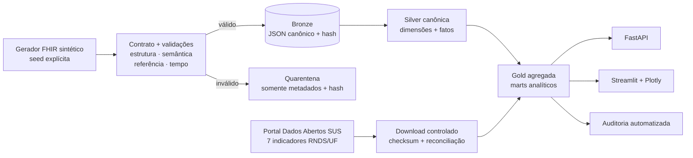

# RNDS Data Quality Lab

[](https://github.com/pedropaulofernandes88-stack/rnds-data-quality-lab/actions/workflows/ci.yml)
[](https://www.python.org/)
[](https://hl7.org/fhir/R4/)
[](LICENSE)

Laboratório reproduzível de engenharia e qualidade de dados em saúde: gera uma
jornada FHIR R4 inteiramente sintética, mapeia eventos demonstrativos aos
cinco domínios demonstrativos — RAC, REL, RIA, RIRA e RPM —, aplica contratos
e quarentena, materializa um
lakehouse Bronze/Silver/Gold e combina o resultado com os sete indicadores
públicos agregados da RNDS.

O projeto demonstra, em uma única entrega, interoperabilidade, modelagem
analítica, ingestão segura, observabilidade, API, visualização, testes
property-based, privacidade e governança.

> [!IMPORTANT]
> Este é um projeto independente de portfólio. Não acessa prontuários, não se
> conecta à RNDS assistencial e não possui homologação ou certificação do
> Ministério da Saúde. Só aceita dados `SYNTHETIC` ou `PUBLIC_AGGREGATE`.

## O que fica demonstrado

| Área | Evidência executável |
| --- | --- |
| Engenharia de dados | ingestão idempotente por SHA-256, DuckDB, camadas Bronze/Silver/Gold, escrita Arrow em lote e linhagem por execução |
| Interoperabilidade | Bundle FHIR R4, referências internas, Provenance e mapeamento demonstrativo RAC/REL/RIA/RIRA/RPM |
| Qualidade | contrato JSON Schema, regras estruturais, semânticas, temporais e referenciais, rejeição integral e quarentena sem payload |
| Dados públicos | downloader HTTPS com limite/timeout/escrita atômica e reconciliação obrigatória UF–região–Brasil |
| Analytics | acesso regulado, turnaround laboratorial, imunização, condições, prescrição, demografia sintética e evolução pública da RNDS |
| Evidência acadêmica | relatório `SYNTHETIC_ONLY` de medianas com bootstrap percentil e benchmark do validador com *ground truth* e IC95% de Wilson |
| Produto | API FastAPI documentada e painel Streamlit/Plotly somente com agregados |
| Segurança e LGPD | scanner de PII/segredos sem eco, proibição de campos identificadores e supressão de células pequenas |
| Qualidade de software | uv lock, Ruff, MyPy estrito, Pytest, Hypothesis, cobertura mínima de 85%, auditoria de dependências e CI offline |

## Arquitetura



O Bundle sintético contém `Patient`, `Organization`, `Encounter`, `Condition`,
`Observation`, `Immunization`, `ServiceRequest`, `MedicationRequest` e
`Provenance`. `MedicationRequest` representa apenas uma prescrição estruturada
sintética no domínio demonstrativo RPM. Sementes
determinísticas variam as 27 UFs, faixas etárias, gênero, classe do atendimento,
CID-10, LOINC/unidade/resultado, vacina/dose, prioridade e espera regulatória.
Não há nomes, CPF, CNS, endereço, telefone, texto clínico livre ou outro
identificador pessoal.

Detalhes: [arquitetura](docs/architecture.md), [dicionário de dados](docs/data-dictionary.md)
e [alinhamento RNDS](docs/rnds-alignment.md).

## Começo rápido

Requisitos: Python 3.11 ou 3.12 e [uv](https://docs.astral.sh/uv/).

```bash
git clone https://github.com/pedropaulofernandes88-stack/rnds-data-quality-lab.git
cd rnds-data-quality-lab
uv sync --all-groups --frozen

# Pipeline offline: 250 jornadas, com falhas intencionais a cada 17 lotes
uv run rnds-lab demo --patients 250 --seed 42 --invalid-every 17

# Auditoria das invariantes do lakehouse
uv run rnds-lab audit

# Atualização opcional dos agregados públicos oficiais
uv run rnds-lab refresh-public
```

No PowerShell, `./scripts/demo.ps1` executa o fluxo reproduzível equivalente.
Dados brutos, banco, quarentena e relatórios ficam locais e são ignorados pelo
Git.

### API

```bash
uv run rnds-lab serve-api
# documentação: http://127.0.0.1:8000/docs
```

Rotas principais:

- `GET /health` e `GET /v1/metadata`;
- `POST /v1/fhir/validate`, que não persiste nem ecoa o Bundle;
- `GET /v1/quality/runs`, `/issues` e `/v1/interoperability/model-volume`;
- `GET /v1/analytics/access`, `/laboratory`, `/immunization`, `/conditions`, `/medication` e `/demographics`;
- `GET /v1/rnds/public-indicators` e `/v1/rnds/brazil-trend`.

Não existe rota de paciente ou prontuário. Contagens sintéticas abaixo do
limiar de divulgação são suprimidas junto com métricas derivadas.

### Relatórios acadêmicos sintéticos

Após carregar jornadas sintéticas no banco local, gere o relatório descritivo
reproduzível abaixo. Ele calcula medianas de espera de encaminhamento e de
turnaround laboratorial, com IC bilateral por bootstrap percentil de 95% e
2.000 reamostragens por padrão. O JSON é marcado `SYNTHETIC_ONLY`, exclui
indicadores públicos e falha se a Bronze contiver recurso não sintético.

```bash
uv run rnds-lab academic-report --output artifacts/academic-report.json --resamples 2000 --seed 20260829
```

O benchmark do validador não lê o lakehouse: gera quatro classes de Bundles
FHIR sintéticos (uma `valid` e três cenários positivos rotulados), usa
`Bundle rejeitado` como decisão positiva e grava matriz de confusão, cobertura
das regras esperadas, sensibilidade, especificidade e precisão com IC95% de
Wilson. Esses resultados dizem respeito somente aos Bundles e regras locais
desse experimento, não à RNDS, a implementações externas de FHIR ou a valor
clínico.

```bash
uv run rnds-lab evaluate-validator --output artifacts/validator-evaluation.json --samples-per-class 100 --seed 20260829
```

### Painel

```bash
uv run rnds-lab dashboard
# http://127.0.0.1:8501
```

O painel separa qualidade, perfis sintéticos, regulação, laboratório, prescrição
sintética e contexto
público da RNDS. As visualizações não devem ser interpretadas como evidência
clínica ou avaliação causal: a coorte é simulada para testar o sistema.

## Fontes e profundidade pública

A carga implementada consome os recursos CSV compactados publicados pelo
Ministério da Saúde para:

- `sdigi008`: total de registros na RNDS;
- `sdigi009`: Registros de Imunobiológicos Administrados (RIA);
- `sdigi010`: Registros de Atendimento Clínico (RAC);
- `sdigi011`: atestados médicos/odontológicos;
- `sdigi013`: prescrições de medicamentos;
- `sdigi014`: Resultados de Exames Laboratoriais (REL);
- `sdigi015`: informações de Regulação Assistencial (RIRA).

A competência, a UF, a região, a data de atualização e os três níveis de total
são preservados. Cada competência deve cobrir exatamente as 27 UFs; totais
negativos, duplicidades ou divergência maior que 0,5 entre níveis interrompem a
carga. O repositório versiona o manifesto e o código, não redistribui os
arquivos obtidos nem suas transformações, em atenção à licença declarada no
portal.

Fontes primárias: [RNDS institucional](https://www.gov.br/saude/pt-br/composicao/seidigi/rnds),
[estrutura e modelos de informação](https://www.gov.br/saude/pt-br/composicao/seidigi/rnds/estrutura-do-projeto),
[Guia de Implementação FHIR](https://rnds-fhir.saude.gov.br/),
[indicadores públicos RNDS](https://dadosabertos.saude.gov.br/dataset/mgdi-rede-nacional-de-dados-em-saude-rnds)
e [guia de integração/ambientes](https://rnds-guia.saude.gov.br/docs/rnds/ambientes/).
CNES, dengue/Sinan e referências populacionais/cartográficas do IBGE estão
catalogados no [manifesto de fontes](data/sources.yml) para extensões futuras,
mas não são baixados pelo pipeline atual.

## Metodologia e controles

O lote é a unidade atômica: se qualquer regra bloqueante falha, todos os nove
recursos da jornada são quarentenados. A saída de quarentena contém apenas
tipo/id sintéticos, regra, severidade, caminho e hash do Bundle. O payload não é
escrito.

A Bronze mantém o JSON canônico e a primeira execução que observou seu hash; a
Silver projeta chaves e tempos úteis por escrita Arrow em lote transacional; a
Gold calcula contagens, médias,
medianas, P90 e séries históricas. Reexecutar a mesma semente produz o mesmo
hash e zero novas linhas Bronze.

A interpretação correta, riscos de viés e desenho de validação temporal,
geográfica e por entidade estão documentados em [metodologia](docs/methodology.md),
[metodologia acadêmica](docs/academic-methodology.md) e
[protocolo de pesquisa](docs/research-protocol.md), além dos
[casos analíticos](docs/analytical-use-cases.md). Privacidade, licenças,
retenção e resposta a incidentes estão em [governança](docs/data-governance.md),
[modelo de ameaças](docs/privacy-threat-model.md) e [SECURITY.md](SECURITY.md).
Contagens, hashes, matriz de confusão, intervalos e ambiente da última execução
estão na [evidência de validação](docs/evidence/latest-validation.md).

## Verificação local

```bash
uv run ruff format --check src tests
uv run ruff check src tests
uv run mypy src
uv run pytest
uv run rnds-lab scan src tests docs data
uv run pip-audit
```

O CI não acessa a internet para obter dados de saúde: testes de download usam
`httpx.MockTransport` e ZIPs construídos em memória. A rede é usada apenas pela
atualização manual explícita. Consulte [reprodutibilidade](docs/reproducibility.md)
e [como contribuir](CONTRIBUTING.md).

## Estrutura

```text
contracts/              JSON Schema e mapeamento demonstrativo RNDS
data/sources.yml        catálogo tipado de origem, licença e limitações
docs/                   arquitetura, metodologia, governança e dicionário
src/rnds_data_lab/      gerador, validação, pipeline, lakehouse, API e painel
tests/                  unitários, integração, propriedades e segurança
.github/workflows/      qualidade automatizada sem download de dados
```

## Limitações deliberadas

- O contrato é um subconjunto educacional de FHIR R4; não valida perfis oficiais
  completos nem substitui um servidor terminológico.
- As tags RAC/REL/RIA/RIRA/RPM são mapeamentos demonstrativos, não uma declaração
  de conformidade ou homologação RNDS.
- Os dados sintéticos medem o comportamento do pipeline, não a saúde da
  população, desempenho assistencial ou cobertura clínica real.
- Supressão primária reduz exposição, mas não elimina inferência por totais e
  cruzamentos; publicação real exigiria revisão complementar.
- Uma integração institucional real requer CNES, credenciamento, certificado,
  homologação e controles definidos pelo Ministério da Saúde.

Licença do código: [MIT](LICENSE). Dados de terceiros permanecem sujeitos aos
termos das fontes originais.
